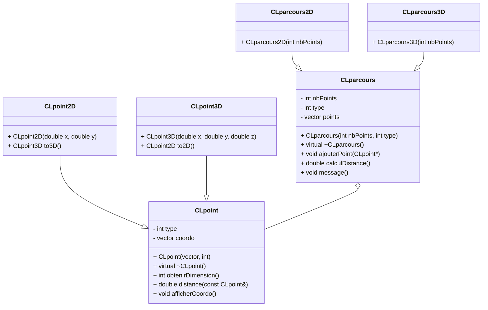

```mermaid
classDiagram
    class CLpoint {
        - int type
        - vector<double> coordo
        + CLpoint(vector<double>, int)
        + virtual ~CLpoint()
        + int obtenirDimension()
        + double distance(const CLpoint&)
        + void afficherCoordo()
    }

    class CLpoint2D {
        + CLpoint2D(double x, double y)
        + CLpoint3D to3D()
    }

    class CLpoint3D {
        + CLpoint3D(double x, double y, double z)
        + CLpoint2D to2D()
    }

    class CLparcours {
        - int nbPoints
        - int type
        - vector<CLpoint*> points
        + CLparcours(int nbPoints, int type)
        + virtual ~CLparcours()
        + void ajouterPoint(CLpoint*)
        + double calculDistance()
        + void message()
    }

    class CLparcours2D {
        + CLparcours2D(int nbPoints)
    }

    class CLparcours3D {
        + CLparcours3D(int nbPoints)
    }

    %% Relations entre les classes
    CLpoint2D --|> CLpoint
    CLpoint3D --|> CLpoint
    CLparcours2D --|> CLparcours
    CLparcours3D --|> CLparcours
    CLparcours o-- CLpoint

```