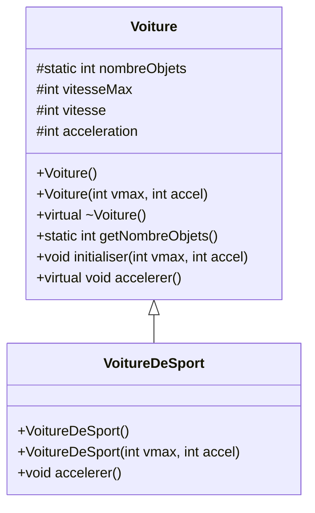

```mermaid
classDiagram
    class Voiture {
        #static int nombreObjets
        #int vitesseMax
        #int vitesse
        #int acceleration
        
        +Voiture()
        +Voiture(int vmax, int accel)
        +virtual ~Voiture()
        +static int getNombreObjets()
        +void initialiser(int vmax, int accel)
        +virtual void accelerer()
    }
    
    class VoitureDeSport {
        +VoitureDeSport()
        +VoitureDeSport(int vmax, int accel)
        +void accelerer()
    }
    
    Voiture <|-- VoitureDeSport
        
```