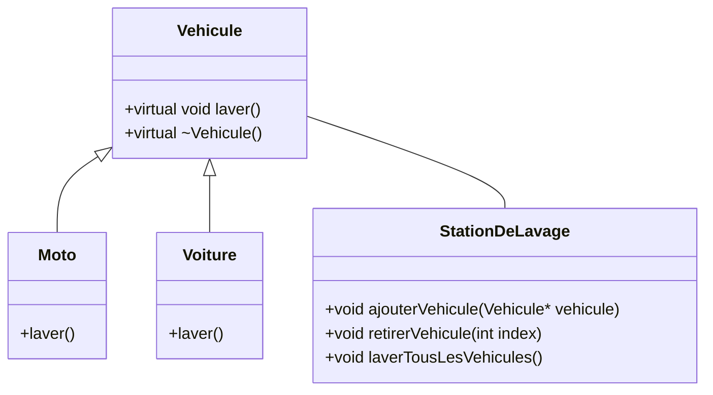

```mermaid
classDiagram
    class Moto {
        +laver()
    }
    
    class Voiture {
        +laver()
    }
    
    class Vehicule {
        +virtual void laver()
        +virtual ~Vehicule()
    }
    
    class StationDeLavage {
        +void ajouterVehicule(Vehicule* vehicule)
        +void retirerVehicule(int index)
        +void laverTousLesVehicules()
    }
    
    Vehicule <|-- Moto
    Vehicule <|-- Voiture
    Vehicule -- StationDeLavage
```